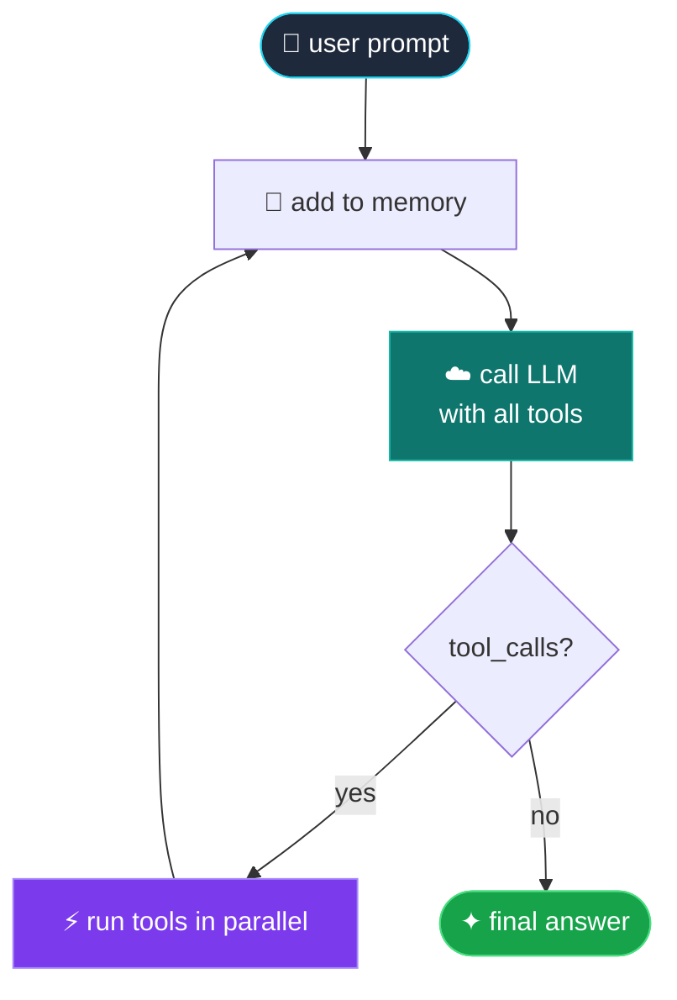
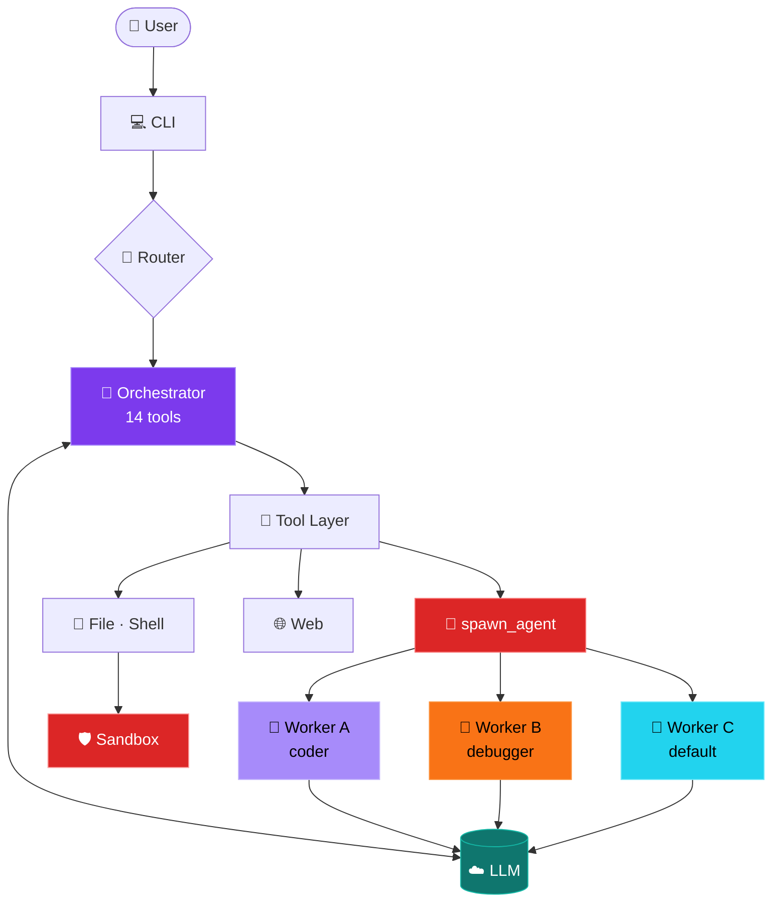
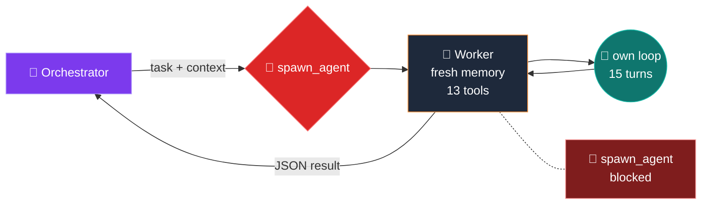

<div align="center">

# ✦ CodeCopilot ✦

### A terminal-native, AI coding assistant with semantic codebase search

[](https://www.python.org/)
[](LICENSE)
[](https://cerebras.ai)

CodeCopilot is an autonomous AI coding agent that lives in your terminal. It plans tasks, edits files, runs code, searches the web, and delegates work to specialized sub-agents — all driven by 13 native function-calling tools.

</div>

---

## ✨ Highlights

| | |
|---|---|
| 🧠 **Multi-agent** | An orchestrator agent spawns isolated worker agents for parallel sub-tasks |
| 🎭 **Personas** | Auto-routes each request to a `coder`, `debugger`, or `default` persona |
| ⚡ **13 Tools** | File I/O, shell, code execution, web search, glob/grep, planning, and more |
| 🛡️ **Sandboxed** | Path traversal protection, secret-file blocklist, per-tool confirmation for writes |
| 🌐 **Project-portable** | Run against any project folder via `--workdir` |
| 🔌 **OpenAI-compatible** | Works with Cerebras, Groq, HF Router, Ollama — anything that speaks the OpenAI chat API |

---

## 🎬 Quick Demo

```text
[19:24] ❯ Build a developer portfolio web app: research glassmorphism designs,
          ask me my accent color, generate mock data, write the HTML/CSS,
          and serve it on port 8000.

→ CODER persona

  🗺️  plan        action=create        ✓ done   (8-step plan)
  🌐  web_search  Modern CSS Glassmorphism tutorials   ✓ done
  ❓  question    What is your favorite accent color?  → "Orange"
  📂  list_files  path=.                               ✓ done
  🔍  glob_tool   pattern=**/*.html                    ✓ done
  ✍️   write_file  generate_data.py                     ✓ done
  🐍  code_exec   ran generate_data.py                 ✓ done
  🤖  spawn_agent worker writes style.css (orange)     ✓ done   (12 tool calls)
  ✍️   write_file  index.html                           ✓ done
  🔧  edit_file   add "Built by CodeCopilot" footer    ✓ done
  ⚡  bash_tool  python -m http.server 8000            ↩ serving on :8000

  ✦ Plan COMPLETE: 'Developer Portfolio Web App'
```

---

## 🔁 The Agentic Loop



The loop ends when the LLM returns a message with no tool calls — that's the final answer. Hard cap of **20 turns** on the orchestrator, **15 turns** on workers, so it can never run forever.

---

## 🚀 Quick Start

### Prerequisites

- **Python 3.10+**
- An API key from any OpenAI-compatible provider. CodeCopilot defaults to [Cerebras](https://cloud.cerebras.ai) (free tier, fast inference, native tool calling).

### 1. Clone & Install

```bash
git clone https://github.com/<your-username>/CodeCopilot.git
cd CodeCopilot
python -m venv .venv
.venv\Scripts\activate          # Windows
# source .venv/bin/activate     # macOS / Linux
pip install -r requirements.txt
```

### 2. Configure your API key

Create a `.env` in the project root:

```dotenv
# Cerebras (recommended — free, fast, generous quota)
CEREBRAS_API_KEY="csk-..."

# Or any other OpenAI-compatible backend:
# OPENAI_API_KEY="..."
# OPENAI_BASE_URL="https://api.groq.com/openai/v1"
# MODEL_ID="llama-3.3-70b-versatile"
```

### 3. Run

```bash
python cli.py                                  # operate on current directory
python cli.py --workdir D:\some\other\project  # operate on another project
python cli.py --persona coder                  # skip auto-routing
```

On Windows you can use the launcher to run from anywhere:

```cmd
codecopilot.bat
codecopilot.bat --workdir D:\my-project
```

Add the install dir to PATH so `codecopilot` works globally:

```powershell
[Environment]::SetEnvironmentVariable("PATH", $env:PATH + ";C:\path\to\CodeCopilot", "User")
```

---

## 🧰 The 14 Tools

| Icon | Tool | What it does |
|---|---|---|
| 📂 | `list_files` | List files and directories |
| 🔍 | `glob_tool` | Match files by pattern (`**/*.py`) |
| 🔎 | `grep_tool` | Regex search across files |
| 📖 | `read_file` | Read a file with offset/limit |
| ✍️  | `write_file` | Create or overwrite a file *(prompts for confirmation)* |
| 🔧 | `edit_file` | Modify an existing file *(prompts for confirmation)* |
| ⚡ | `bash_tool` | Run shell commands (sandboxed cwd) |
| 🐍 | `code_exec` | Execute Python snippets in a subprocess |
| 🌐 | `web_search` | Search the web via DuckDuckGo |
| 🌍 | `fetch_url` | Fetch and extract text from a URL |
| 🗺️  | `plan` | Create / track a structured execution plan |
| ❓ | `question_tool` | Ask the user a clarifying question |
| 🤖 | `spawn_agent` | Delegate a sub-task to an isolated worker agent |

Tools that modify files (`write_file`, `edit_file`) always pause for `[Y/n]` confirmation.

---

## 🤖 Multi-Agent Architecture



**Key invariants:**

- The **orchestrator** has all 13 tools. Workers get 12 (no `spawn_agent` → no recursion).
- **Tool calls execute in parallel** when the LLM returns multiple in one turn (`ThreadPoolExecutor`, max 4 concurrent).
- Workers get a **fresh memory** plus an explicit `context` argument from the orchestrator — they don't share state with the parent or with each other.
- **Hard caps:** orchestrator 20 turns, workers 15 turns. Prevents runaway loops.

### 🤖 Inside `spawn_agent`



**Why this matters:**

- Workers don't see the parent's conversation — only the explicit `context` string. **Prevents context pollution** between sub-tasks.
- Workers can use any tool except `spawn_agent`, so they can read files, search the web, run code, but **cannot recursively spawn**. No infinite agent trees.
- Multiple workers run **in parallel** (up to `MAX_PARALLEL_TOOLS = 4`).
- Result is wrapped in JSON (`{status, answer, tool_calls_made}`) and injected back as a normal tool result.

---

## 🛡️ Safety

- **Path sandbox.** All file tools resolve paths against the project root and reject anything outside it (path traversal, symlink attacks).
- **Sensitive files blocked.** `.env`, `.git/`, `id_rsa`, hidden dotfiles — read or write attempts fail at the tool layer.
- **Confirmation gate.** `write_file` and `edit_file` prompt the user for `[Y/n]` before applying changes.
- **No spawn recursion.** Workers cannot spawn further workers, preventing infinite agent trees.
- **Turn limits.** Orchestrator: 20 turns. Workers: 15 turns. Hard caps prevent runaway loops.

---

## 🎮 CLI Commands

| Command | Action |
|---|---|
| `/help` | Show all commands |
| `/tools` | List all loaded tools |
| `/clear` | Clear conversation history |
| `/persona <name>` | Switch persona: `coder` \| `debugger` \| `default` |
| `/cwd` | Show current working directory |
| `exit` / `quit` | Exit |

---

## 🎭 Personas

| Persona | Best for | System prompt focus |
|---|---|---|
| **coder** | Building features, refactoring, writing new code | "Senior Software Engineer", planning + safety |
| **debugger** | Fixing bugs, diagnosing errors, tracing failures | "Principal Code Debugging Specialist", evidence-first |
| **default** | Research, explanations, mixed tasks | General-purpose with web access |

By default the CLI **auto-routes** each first message via a small classifier model. Use `--persona <name>` to lock in one persona.

---

## ⚙️ Configuration

All settings live in `utils/config.py` and can be overridden via `.env`:

| Variable | Default | Purpose |
|---|---|---|
| `CEREBRAS_API_KEY` | — | API key for Cerebras |
| `OPENAI_BASE_URL` | `https://api.cerebras.ai/v1` | Inference backend URL |
| `MODEL_ID` | `zai-glm-4.6` | Main agent model |
| `ROUTER_MODEL` | same as `MODEL_ID` | Persona-classification model |
| `MAX_AGENTIC_TURNS` | `20` | Max LLM↔tool loops per message |
| `MAX_PARALLEL_TOOLS` | `4` | Max concurrent tool calls per turn |

---

## 📁 Project Structure

```
CodeCopilot/
├── cli.py                    # Interactive terminal UI
├── main.py                   # Orchestrator agent + agentic loop
├── tool_registry.py          # Auto-discovers tools from tools/
├── codecopilot.bat           # Windows launcher
│
├── agents/
│   ├── router.py             # Persona classifier
│   └── worker.py             # Isolated WorkerAgent (no recursion)
│
├── tools/                    # 13 tools — drop-in autoloaded
│   ├── bash.py    code_exec.py    edit.py
│   ├── fetch_url.py    glob.py    grep.py
│   ├── list.py    plan.py    question.py    read.py
│   ├── spawn_agent.py    web_search.py    write.py
│
└── utils/
    ├── config.py             # Central Config dataclass + AgentEvent
    ├── context.py            # Conversation memory + token budgeting
    ├── prompts.py            # Persona system prompts
    ├── schema_helper.py      # @tool decorator + JSON schema generation
    └── secure_fs.py          # Path sandbox + blocklist
```

---

## 🧪 Stress Test Prompt

Drop this single prompt into the CLI to exercise every tool:

```
Build a Developer Portfolio Web App. You MUST follow these steps and use the
exact tools mentioned:
1. plan(action='create') — break this into phases.
2. web_search + fetch_url — find a glassmorphism CSS tutorial.
3. question_tool — ask my favorite accent color.
4. glob_tool — see what HTML/CSS exists.
5. write_file + code_exec — generate_data.py with mock JSON.
6. spawn_agent — delegate writing style.css to a worker (use the color).
7. write_file — create index.html.
8. edit_file — add "Built by CodeCopilot" footer.
9. bash_tool — serve on port 8000.
```

This exercises 12 of 13 tools (everything except a second `spawn_agent`) and chains them through a structured plan.

---

## 🛠️ Troubleshooting

**`401 Unauthorized` from the LLM.** Check that the right API key for your active backend is in `.env` and that no stale system env var (`OPENAI_API_KEY`) is overriding it. Restart the CLI after editing `.env`.

**`429 queue_exceeded`.** The provider's free-tier inference queue is busy. Wait 30s and retry, or set `MODEL_ID` to a smaller model in `.env`.

---

## 📜 License

MIT — see [LICENSE](LICENSE).

---

<div align="center">
<sub>Built with ❤️ in the terminal.</sub>
</div>
